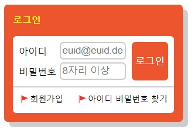

HTML
로그인 박스 전체를 div묶어주고 h1으로 제목을 작성하였다

form 태그 를 사용하여 사용자 정보를 수집하는 태그들을 묶어주었다

사용자의 민감한 개인정보를 담기 때문에 method="POST" 방식을 사용하였다 <

폼 컨트롤을 그룹화하는 데 사용하는 filedset과 legend 태그를 사용하였다

아이디와 비밀번호는 정렬을 위해 ul 묶고 각각 li를 사용하였다

아이디와 비밀번호 폼을 input태그 를 써서 만들어 주었다

각각 폼에 라벨을 달고 같은 id를 지정하여 연결하였다

정보를 제출할 때 사용할 로그인 버튼을 button태그로 만들었다

회원가입과 아이디 비밀번호 찾기 항목을 a를 사용하여 링크를 연결시켜주었고 div로 묶어주었다

CSS
로그인 전체 박스

아이디 폼, 비밀번호 폼, 로그인 버튼을 포함하는 박스

회원가입, 아이디/비밀번호 찾기를 포함하는 박스

아이디 폼 박스, 아이디input박스 label박스

비밀번호 폼 박스, 비밀번호input박스 label박스

로그인 버튼 박스

회원가입 박스, 아이디/비밀보호 찾기 박스로 지정하여

높이와 너비를 지정하고 margin padding값을 조절하여 박스의 크기를 맞춰주었다.

필요에 따라 border의 스타일과 색상, font 사이즈와 색상 배경 색상 등을 지정하여 꾸며주었다.

position 속성을 활용하여 위치를 지정하였다.

아이디 박스와 비밀번호 박스, 로그인 버튼은

부모에 position:relative;를 주고

자식에 position:absolute;를 지정한 뒤 위치를 조정하였다.

회원가입, 아이디/비밀번호 찾기 영역은 각각 float:left, float:right을 사용한 뒤

텍스트를 가운데 위치시키기 위해 padding-top 값을 4px;로 주어 위치를 조정하였다.

