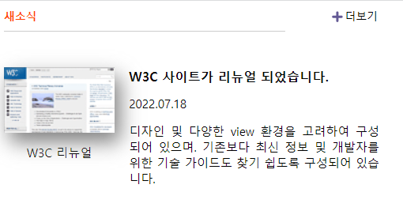

<h1>HTML</h1>

전체 구역을 section 으로 묶어주었다

제목에 h2태그를 주고 더보기는 a태그로 링크를 만들어 주었다

각각 클래스명을 주었다

이미지와 figcaption은 figure로 묶어주었다

기사 내용 전체를 div로 묶어주고

각각 제목과 날짜 내용으로 나누어 클래스를 주었다

<h1>CSS</h1>

grid-template-columns: repeat(12,1fr); 

grid-template-rows: auto;

grid-template-areas: 

"title title title title title title title title title link link link"

"img img img img newstext newstext newstext newstext newstext newstext newstext newstext" ;

그리드 속성을 활용하여 각각 요소들을 배치하였다

이후 각 아이템에 적절한 margin값과 padding값을 주어서 조금 더 정밀하게 배치시켰다

글자 크기와 굵기, 스타일을 주어 꾸며주었다

이미지에 filter: drop-shadow(6px 10px 10px gray); 활용하여 그림자를 만들었다

