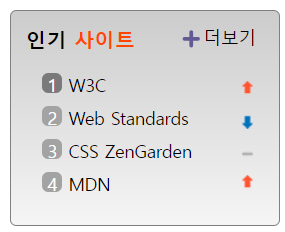

<h1>HTML</h1>

제목 

h3태그와 span 태그를 활용하였다 색상을 다르게 지정하기 위해 span으로 더 묶어주었다

더보기

링크태그 활용

인기 사이트 목록

ol태그와 li태그를 활용  클래스에 sprite 넣어서 css에서 활용하도록 하였다

<h1>CSS</h1>

flex를 활용하여 제목을 배치시켰다

list에 before가상요소를 활용하여 꾸며주었다

counter함수를 활용해 순번을 붙여주었다

inline-flex를 활용하여 배치하였다

각 리스트 옆 화살표 이미지는 sprite 기법을 활용하였다

이미지 하나로  위치를 조정하여 각 목록마다 시안에 맞는 이미지를 부여하였다

